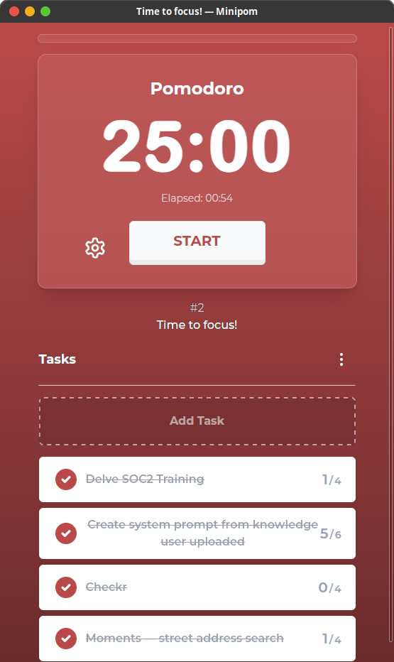

# Minipom

<div align="center">
  
  <br />
  
</div>

A minimalistic and elegant Pomodoro timer desktop application built with Tauri and SvelteKit. Minipom helps you stay focused and productive using the Pomodoro Technique, featuring a clean interface and customizable settings.

## ✨ Features

- 🎯 Clean and minimalistic user interface
- ⏱️ Customizable Pomodoro timer settings
- 🎵 Built-in sound notifications
- 🖥️ Cross-platform support (Windows, macOS, Linux)
- 🚀 Native performance with Tauri
- 🎨 Modern UI with Tailwind CSS and Shadcn

## 🛠️ Tech Stack

- **Frontend**

  - [SvelteKit](https://kit.svelte.dev/) - Full-stack web framework
  - [TypeScript](https://www.typescriptlang.org/) - Type-safe JavaScript
  - [Tailwind CSS](https://tailwindcss.com/) - Utility-first CSS framework
  - [Shadcn Svelte](https://www.shadcn-svelte.com/) - UI component library
  - [Lucide Svelte](https://lucide.dev/) - Beautiful icons
  - [TS Pattern](https://github.com/gvergnaud/ts-pattern) - Pattern matching library

- **Backend**
  - [Tauri](https://tauri.app/) - Desktop application framework
  - [Rust](https://www.rust-lang.org/) - Systems programming language
  - [Rodio](https://github.com/RustAudio/rodio) - Audio playback library

## 🚀 Getting Started

### Prerequisites

- [Node.js](https://nodejs.org/) (Latest LTS version recommended)
- [Rust](https://www.rust-lang.org/tools/install)
- [pnpm](https://pnpm.io/) (Package manager)

### Installation

#### Using Pacstall (Debian & Ubuntu)

Install Minipom using [Pacstall](https://pacstall.dev/), the AUR-inspired package manager for Ubuntu/Debian:

```bash
pacstall -I minipom-deb
```

#### Download from GitHub Releases

1. Go to the [Releases page](https://github.com/tfkhdyt/minipom/releases)
2. Download the appropriate package for your system:

   - **Linux**: `.deb` (Debian/Ubuntu), `.rpm` (Red Hat/Fedora), or `.AppImage` (Universal)
   - **Windows**: `.exe` or `.msi` installer

3. Install the downloaded package:

   ```bash
   # For .deb packages (Debian/Ubuntu)
   sudo dpkg -i Minipom_*.deb

   # For .rpm packages (Red Hat/Fedora)
   sudo rpm -i Minipom-*.rpm

   # For .AppImage (make executable and run)
   chmod +x Minipom_*.AppImage
   ./Minipom_*.AppImage
   ```

#### Building from Source

1. Clone the repository:

```bash
git clone https://github.com/tfkhdyt/minipom.git
cd minipom
```

2. Install dependencies:

```bash
pnpm install
```

3. Build the application:

For Linux:

```bash
# For Debian & Ubuntu based distros
pnpm tauri build -b deb

# For Red hat based distros
pnpm tauri build -b rpm

# for appimage
pnpm tauri build -b appimage
```

For Windows:

```bash
# For .exe installer
pnpm tauri build -b nsis

# For .msi installer
pnpm tauri build -b msi
```

For macOS:

```bash
# For .app bundle
pnpm tauri build -b app

# For .dmg installer
pnpm tauri build -b dmg
```

#### Using Nix Flakes (Needs New Maintainer)

1. Add the flake input to your configuration:

```nix
{
    inputs.minipom = {
      url = "github:tfkhdyt/minipom?ref=v0.9.3";
      inputs.nixpkgs.follows = "nixpkgs";
    };
}
```

2. Add to your system packages:

```nix
environment.systemPackages = [
    inputs.minipom.packages.${pkgs.system}.default
];
```

3. Or to your home manager packages:

```nix
{ inputs, ... }: {
    home.packages = [
        inputs.minipom.packages.${pkgs.system}.default
    ];
}
```

## 🎯 Usage

1. Launch Minipom
2. Set your desired work duration (default: 25 minutes)
3. Click the start button to begin your Pomodoro session
4. Take breaks when the timer completes
5. Repeat the process to maintain productivity

## 🤝 Contributing

Contributions are welcome! Please feel free to submit a Pull Request.

1. Fork the repository
2. Create your feature branch (`git checkout -b feature/amazing-feature`)
3. Commit your changes (`git commit -m 'Add some amazing feature'`)
4. Push to the branch (`git push origin feature/amazing-feature`)
5. Open a Pull Request

## 📝 License

This project is licensed under the GPL License - see the [LICENSE](LICENSE) file for details.

## 🙏 Acknowledgments

- Inspired by [pomofocus.io](https://pomofocus.io/)
- Thanks to all contributors and users of Minipom
